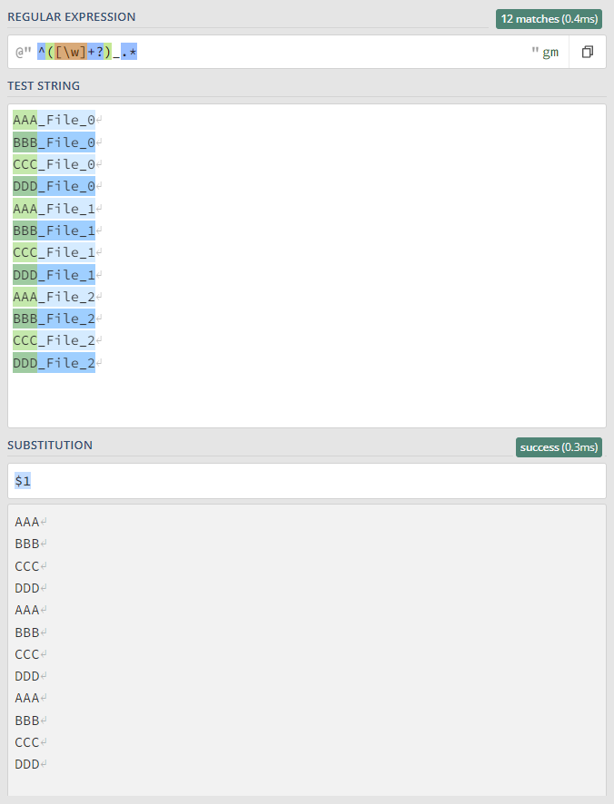
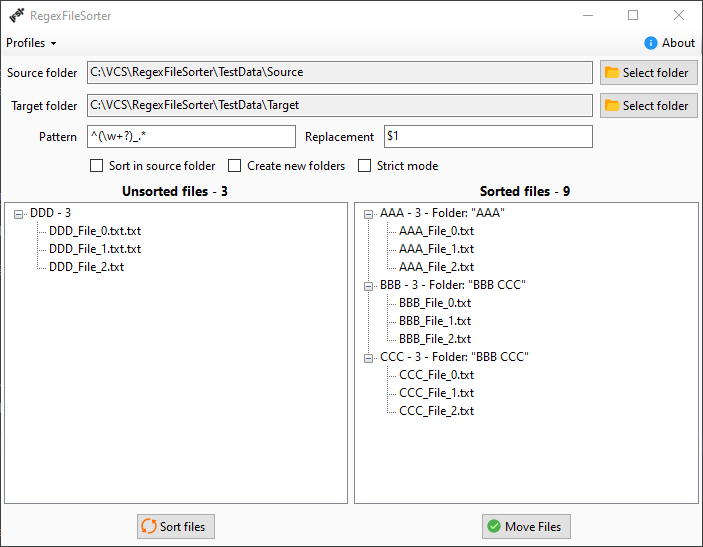

# RegexFileSorter [![Build artifact][build-src]][build-href] [![Codacy Badge][codacy-src]][codacy-href]

Application for sorting files by filename using regex pattern

## Options

* Sort in source folder - Use Source folder for instead of Target folder
* Create new folders - Create new folders with the group name
* Strict mode - The name of the folder must exactly match the name of the group

## How to use

1. Open [regex101](https://regex101.com/), select C# flavor and substitution function
2. Create pattern and replacement what works for you
3. Select **Source** and **Target** folder
4. Click **Sort** to see preview
5. Click **Move** to move files to target folders

### Example

This pattern matches first word before `_` and `$1` gets replaced with it.  
Then all matched files grouped by result and sorted to folders in **Target** folder.

## Notes

* You can drag&drop folders to **Source/Target** text box

<!-- Badges -->
[build-src]: https://img.shields.io/github/actions/workflow/status/Virenbar/RegexFileSorter/build-artifact.yml?label=Build&logo=github
[build-href]: https://github.com/Virenbar/RegexFileSorter/actions/workflows/build-artifact.yml

[codacy-src]: https://app.codacy.com/project/badge/Grade/3a523285a2284e719615cf3ab5af6555
[codacy-href]: https://app.codacy.com/gh/Virenbar/RegexFileSorter/dashboard?utm_source=gh&utm_medium=referral&utm_content=&utm_campaign=Badge_grade
