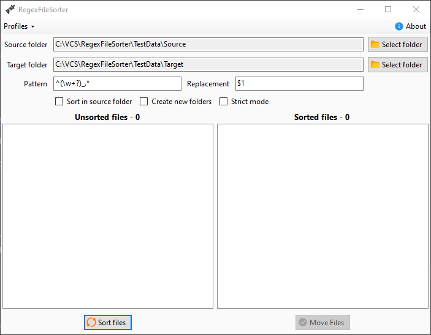

# RegexFileSorter [![Build artifact][build-src]][build-href] [![Codacy Badge][codacy-src]][codacy-href]

Small application for sorting files by filename using regex

<!-- Badges -->
[build-src]: https://img.shields.io/github/actions/workflow/status/Virenbar/RegexFileSorter/build-artifact.yml?label=Build&logo=github
[build-href]: https://github.com/Virenbar/RegexFileSorter/actions/workflows/build-artifact.yml

[codacy-src]: https://app.codacy.com/project/badge/Grade/3a523285a2284e719615cf3ab5af6555
[codacy-href]: https://app.codacy.com/gh/Virenbar/RegexFileSorter/dashboard?utm_source=gh&utm_medium=referral&utm_content=&utm_campaign=Badge_grade
